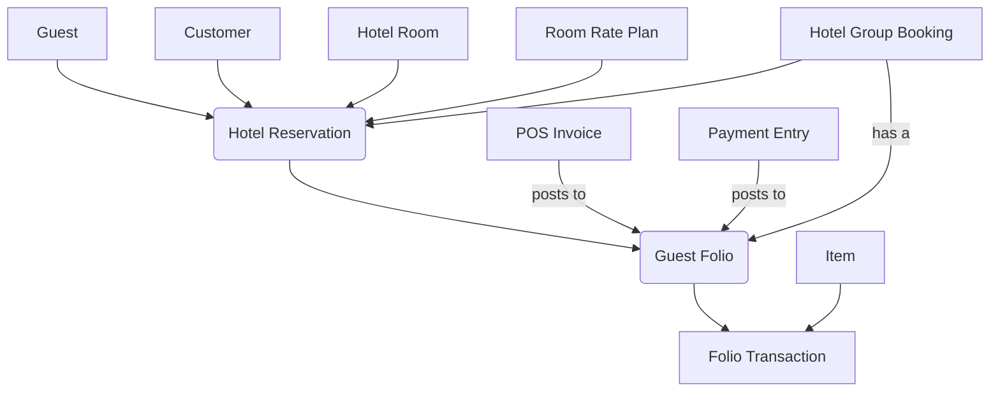

# Hospitality Core for ERPNext: The Native Hotel Management System


**Hospitality Core** is a complete, enterprise-grade Property Management System (PMS) built natively within the Frappe Framework. It transforms your ERPNext instance into a powerful, single-source-of-truth solution for hotel operations, eliminating the need for fragile third-party integrations for core financial and inventory functions.

Designed for markets where robust internal controls, real-time inventory management, and sophisticated corporate billing are paramount, this application prioritizes operational integrity over costly and often unnecessary external API dependencies.

---

## 📖 Table of Contents

1.  [**Our Philosophy: Control, Not Connectivity**](#-our-philosophy-control-not-connectivity)
2.  [**Key Differentiators**](#-key-differentiators)
3.  [**In-Depth Feature Analysis**](#-in-depth-feature-analysis)
    *   [Front Office & Guest Management](#-front-office--guest-management)
    *   [Financial Engine & Folio Management](#-financial-engine--folio-management)
    *   [Housekeeping & Maintenance](#-housekeeping--maintenance)
    *   [Group & Corporate Bookings](#-group--corporate-bookings)
    *   [Rate & Inventory Management](#-rate--inventory-management)
    *   [ERPNext Native Integrations](#-erpnext-native-integrations)
4.  [**Operational Workflow Guides**](#-operational-workflow-guides)
    *   [Lifecycle of a Private Guest](#1-lifecycle-of-a-private-guest)
    *   [Lifecycle of a Corporate Guest (City Ledger)](#2-lifecycle-of-a-corporate-guest-city-ledger)
    *   [Processing a Restaurant Bill to a Room](#3-processing-a-restaurant-bill-to-a-room)
    *   [Handling a Group Booking](#4-handling-a-group-booking)
5.  [**The Reporting Suite**](#-the-reporting-suite)
6.  [**Installation & Configuration**](#-installation--configuration)
    *   [Prerequisites](#prerequisites)
    *   [Installation Steps](#installation-steps)
    *   [Initial Setup Checklist](#initial-setup-checklist)
7.  [**Technical Architecture Deep Dive**](#-technical-architecture-deep-dive)
    *   [Core DocTypes & Their Relationships](#core-doctypes--their-relationships)
    *   [Hooks & Event-Driven Logic](#hooks--event-driven-logic)
    *   [The Night Audit Engine](#the-night-audit-engine)
8.  [**Contributing & Customization**](#-contributing--customization)
9.  [**License**](#-license)

---

##  Our Philosophy: Control, Not Connectivity

**Hospitality Core** is built on the philosophy of **Internal Control**. By leveraging the power of ERPNext, we provide a unified system where:
*   **Finance is Live:** Every charge posted to a room is a real-time entry impacting your ledgers. There is no "end-of-day sync" that can fail.
*   **Inventory is Secure:** A minibar item charged to a guest is immediately deducted from a specific room's warehouse, providing unparalleled control over stock shrinkage.
*   **Data is Centralized:** Guest history, corporate accounts, and financial performance data all reside in one database, enabling powerful, holistic reporting that is impossible with bridged systems.

This makes it the ideal solution for boutique hotels, business hotels, and serviced apartments that demand precision, security, and financial integrity from their management software.

## ✨ Key Differentiators

*   **True ERP Integration:** This is not a "sync" or an "integration." The PMS *is* the ERP. Your front desk, restaurant, and accounting teams all work from the same live data.
*   **Sophisticated City Ledger Management:** The system automates the complex accounting required for corporate clients. Charges can be automatically mirrored from individual guest folios to a master company folio, allowing guests to check out with a zero balance while their company's debt is tracked separately.
*   **Granular Inventory Control:** Uniquely, each hotel room can be mapped to its own stock `Warehouse`. When a POS transaction for a minibar item is posted, the system deducts the stock from that specific room's inventory, providing a powerful tool against theft and for operational efficiency.
*   **Comprehensive Workspace & Visual Tools:** From the `Front Desk Console` to the `Tape Chart`, the user interface is designed for the high-speed, visual nature of front office work, while still being backed by the robust structure of ERPNext.

---

## 🚀 In-Depth Feature Analysis

### 🏨 Front Office & Guest Management

#### 1. Front Desk Console
*   **What it is:** A single-page application serving as the command center for the front desk.
*   **How it Works:** Powered by `hospitality_core/page/front_desk_console/`, the `get_console_data` function in `front_desk_console.py` runs a series of optimized SQL queries to calculate date-sensitive KPIs: pending arrivals, pending departures, in-house occupancy, and net room availability. The results are rendered by `front_desk_console.js` into an interactive dashboard with clickable links.
*   **Business Value:** Provides the Manager on Duty with an instant, "at-a-glance" view of the day's operations, allowing for quick decisions on staffing and sales strategy.

#### 2. Tape Chart (Reservation Calendar)
*   **What it is:** A visual, grid-based calendar showing rooms on the Y-axis and dates on the X-axis.
*   **How it Works:** The `tape_chart.js` frontend makes an AJAX call to `get_chart_data` in `tape_chart.py`. This function fetches all enabled rooms and overlays them with reservations that fall within the selected date range. The logic `arrival_date < end AND departure_date > start` correctly captures all overlapping bookings. Bookings are color-coded based on their status (`Reserved` vs. `Checked In`).
*   **Business Value:** Allows reservation agents to visually identify gaps and booking patterns, making it faster to place new reservations and manage room assignments.

#### 3. Guest 360 View
*   **What it is:** A dedicated page to view the complete history and value of any guest.
*   **How it Works:** The `guest_360.js` page takes a Guest ID and calls `get_guest_details` in `guest_360.py`. This function consolidates data from the `Guest` doctype, all associated `Hotel Reservation` documents, and aggregates financial data from `Guest Folio` documents to calculate metrics like Total Stays and Lifetime Spend.
*   **Business Value:** Empowers staff to recognize and reward loyal customers. Identifying a high-value guest upon check-in can significantly enhance the guest experience.

#### 4. Guest & Reservation Management
*   **DocTypes:** `Guest`, `Hotel Reservation`
*   **How it Works:** The `Hotel Reservation` document is the core operational record. Its Python class (`hotel_reservation.py`) contains the state machine logic for a guest's stay (`process_check_in`, `process_check_out`, `process_cancel`). The system enforces strict validation, such as using `check_availability` to prevent double bookings. Upon creation, it automatically triggers the creation of a `Guest Folio` via the `after_insert` hook.
*   **Business Value:** A secure and auditable system for managing the entire guest lifecycle, with clear state transitions that prevent common operational errors.

### 💰 Financial Engine & Folio Management

#### 1. The Folio System
*   **DocTypes:** `Guest Folio`, `Folio Transaction`
*   **How it Works:** The `Guest Folio` acts as the master bill for a guest's stay. All financial events are recorded as child documents in the `Folio Transaction` table. The core financial logic resides in `hospitality_core/api/folio.py`. The `sync_folio_balance` function is the heart of the system, triggered by `doc_events` in `hooks.py` whenever a transaction is saved or trashed. It uses an aggregation query to recalculate `total_charges`, `total_payments`, and `outstanding_balance`, ensuring the folio is always accurate.
*   **Business Value:** Provides a clear, itemized, and always up-to-date bill for the guest, ensuring transparency and reducing checkout disputes.

#### 2. City Ledger & Corporate Folio Mirroring
*   **What it is:** The system's ability to manage bills owed by companies, separate from the guests who stayed.
*   **How it Works:** When a reservation is marked as `is_company_guest`, a master folio for that company is created (`ensure_company_folio` in `hotel_reservation.py`). During the stay, any transaction posted to the guest's folio with `bill_to = 'Company'` triggers the `mirror_to_company_folio` function. This function creates an exact copy of the transaction on the Company's Master Folio, ensuring both ledgers are in sync. At checkout, the guest's folio balance related to company charges is transferred off, allowing the guest to leave while the debt remains with the company.
*   **Business Value:** This is a critical feature for business hotels. It streamlines corporate billing, reduces checkout friction for corporate guests, and provides the accounting department with a clean, actionable list of corporate debtors (the City Ledger).

#### 3. Financial Controls
*   **DocTypes:** `Allowance Reason Code`
*   **How it Works:** To void a charge, a user must select a reason from the `Allowance Reason Code` list. The `void_transaction` function in `financial_control.py` checks if the selected reason `requires_manager_approval`. If so, it verifies the user's roles before proceeding. This prevents unauthorized write-offs.
*   **Business Value:** Enforces accountability and reduces revenue leakage from fraudulent or unwarranted voids and discounts.

### 🧹 Housekeeping & Maintenance

#### 1. Housekeeping Board
*   **What it is:** A visual grid of all hotel rooms, color-coded by their housekeeping status.
*   **How it Works:** The `housekeeping_view.js` page calls `get_room_statuses` in `housekeeping_view.py` to fetch the live status of all rooms. Housekeeping staff can click a button to change a room's status from `Dirty` to `Available` (Clean). This action calls `set_room_status`, which includes a permission check to ensure only authorized staff can update statuses.
*   **Business Value:** Creates a direct line of communication between housekeeping and the front desk, speeding up room turnover and ensuring guests are checked into clean rooms.

#### 2. Maintenance Management
*   **DocType:** `Hotel Maintenance Request`
*   **How it Works:** When a maintenance request is created for a room (e.g., "Leaky Faucet"), the `on_update` logic in `hotel_maintenance_request.py` is triggered. If the request status is `Reported` or `In Progress`, the system automatically changes the `Hotel Room` status to `Out of Order`. When the request is `Completed`, the room status is set to `Dirty`, queuing it for housekeeping.
*   **Business Value:** Prevents guest complaints and revenue loss by ensuring rooms with defects are automatically taken out of inventory and only returned after being serviced and cleaned.

### 🏢 Group & Corporate Bookings

*   **DocType:** `Hotel Group Booking`
*   **How it Works:** This document acts as a container for multiple individual reservations. The `hotel_group_booking.js` adds custom buttons to the form, allowing a user to `Create Master Folio`, `Link Reservations`, `Check In Group`, and `Check Out Group`. These buttons call whitelisted API functions in `group_booking.py` that loop through associated reservations and apply the state changes in bulk.
*   **Business Value:** Massively improves efficiency when managing wedding parties, conference attendees, or tour groups, reducing dozens of clicks to a single action.

### 📈 Rate & Inventory Management

*   **DocTypes:** `Hotel Room Type`, `Room Rate Plan`, `Hotel Room`
*   **How it works:** The system uses a hierarchical rate structure. The base rate is set on the `Hotel Room Type`. This can be overridden by a `Room Rate Plan` for specific date ranges (e.g., seasonal or weekend pricing). The `get_rate` function in `night_audit.py` contains the logic to find the correct price for a given day, falling back from the rate plan to the default type rate.
*   **Business Value:** Allows for basic yield management and simplifies rate administration across the entire property.

### 🔗 ERPNext Native Integrations

#### 1. Point of Sale (POS) Bridge
*   **How it Works:** The `on_submit` hook for `POS Invoice` (in `hooks.py`) triggers `process_room_charge` in `pos_bridge.py`. This function checks for a payment made via the "Room Charge" `Mode of Payment`. It then posts each line item from the POS receipt to the guest's `Guest Folio`, referencing the original `POS Invoice` for traceability.
*   **Business Value:** Creates a seamless guest experience. A guest can have a meal at the restaurant, sign the bill to their room, and see the charge appear on their folio instantly without any manual data entry by staff.

#### 2. Stock & Inventory Bridge
*   **How it Works:** A custom function `deduct_inventory` in `stock.py` is designed to be called when a `Folio Transaction` is posted. It checks if the item is a `stock_item`. If so, it creates and submits a `Stock Entry` (Material Issue) from the warehouse associated with the `Hotel Room`, effectively consuming the inventory.
*   **Business Value:** Provides unparalleled control over high-value, high-turnover inventory like minibar items. Management can run reports to see consumption per room and identify discrepancies immediately.

#### 3. Payments Bridge
*   **How it Works:** The `on_submit` hook for `Payment Entry` triggers `process_payment_entry` in `payment_bridge.py`. If the `reference_no` field of the Payment Entry matches a `Guest Folio` name, the function automatically posts a credit transaction to that folio.
*   **Business Value:** Ensures that when a payment is recorded in the main accounting system, it is immediately reflected on the guest's hotel bill, preventing checkout delays and billing errors.

---

## 🗺️ Operational Workflow Guides

### 1. Lifecycle of a Private Guest
1.  **Reservation:** A Front Desk agent creates a `Hotel Reservation` via the **Tape Chart** for John Doe, arriving in 3 days. The system creates a `Guest Folio` in `Provisional` status.
2.  **Check-In:** John Doe arrives. The agent opens the reservation and clicks **Check In**. The room status becomes `Occupied`, the folio becomes `Open`, and the first night's rent is posted.
3.  **Stay:** John orders room service. The charge is posted to his folio. The Night Audit runs automatically at 2 PM, posting the second night's rent.
4.  **Check-Out:** John comes to the desk. The agent opens his folio, which shows a balance of N50,000. John pays with his card. The agent clicks **Record Payment**, which opens a pre-filled `Payment Entry` form. Upon submission, a credit of N50,000 is posted to the folio, making the balance zero.
5.  **Departure:** The agent clicks **Check Out** on the reservation. The room status becomes `Dirty`, and the folio is `Closed`.

### 2. Lifecycle of a Corporate Guest (City Ledger)
1.  **Reservation:** A reservation is made for Jane Smith from "ABC Corp". The agent checks **"Is Company Guest"** and selects "ABC Corp" as the `Company`.
2.  **Check-In:** Jane checks in. The process is the same, but the system ensures a Master Folio for "ABC Corp" exists.
3.  **Stay:** The Night Audit posts the room rent. Because of the routing rules, the charge is posted to Jane's folio but simultaneously **mirrored** to the ABC Corp Master Folio.
4.  **Check-Out:** Jane comes to the desk. Her personal folio shows a balance of N0.00 (or only personal incidentals). The agent clicks **Check Out**. The system automatically transfers any remaining company-liable balance to the Master Folio.
5.  **Post-Departure:** The Accounting department now sees the debt on the ABC Corp Master Folio and follows up with the company for payment, completely separate from Jane's stay.

### 3. Processing a Restaurant Bill to a Room
1.  A guest in Room 101 finishes their meal.
2.  The waiter creates a `POS Invoice` for the table.
3.  For payment, the waiter selects `Mode of Payment: Room Charge`.
4.  The system prompts for a `Hotel Room Number`. The waiter enters "101".
5.  The waiter submits the POS Invoice.
6.  Instantly, the `process_room_charge` hook fires, and the N15,000 food charge appears on the `Guest Folio` for Room 101.

### 4. Handling a Group Booking
1.  **Setup:** A `Hotel Group Booking` is created for the "Smith Wedding". The Master Payer is set to "Mr. Smith (Customer)".
2.  **Folio:** The manager clicks **Create Master Folio**. A folio is created for Mr. Smith to handle group charges.
3.  **Linking:** As individual guests from the party book rooms, their `Hotel Reservation` documents are linked to the "Smith Wedding" group booking.
4.  **Mass Check-In:** On the day of arrival, the manager opens the Group Booking and clicks **Check In Group**. The system finds all 15 `Reserved` rooms and checks them in with one click.
5.  **Billing:** All room charges are automatically routed and mirrored to Mr. Smith's Master Folio.
6.  **Mass Check-Out:** The group departs. The manager clicks **Check Out Group**, and all 15 rooms are checked out.

---

## 📊 The Reporting Suite

The application includes a suite of script reports designed to provide actionable insights.

*   **Daily Arrivals/Departures:** Essential lists for front desk and bell services.
*   **House List:** A snapshot of all in-house guests for any given date, crucial for emergency and daily operations meetings.
*   **Guest Ledger:** A live debtors list showing exactly how much money is owed by **private guests** currently staying in the hotel.
*   **City Ledger:** The corporate debtors list, showing outstanding balances for all company accounts.
*   **Folio Balance Summary:** A high-level dashboard report that provides the total receivable balance, broken down between the Guest Ledger and City Ledger.
*   **Daily Sales Consumption:** A detailed breakdown of all revenue generated, categorized by department (Item Group), helping management understand which outlets are performing best.
*   **Void and Allowance Report:** A critical audit report that lists every single voided transaction and discount, including the reason and the authorizing user.
*   **Hotel Performance Analytics:** A manager's dream report, showing key performance indicators (KPIs) like Occupancy %, Average Daily Rate (ADR), and Revenue Per Available Room (RevPAR) over a date range.

---

## 🛠️ Installation & Configuration

### Prerequisites
*   Frappe Framework: v14 or higher
*   ERPNext: v14 or higher (for Accounts, Stock, and POS modules)
*   A running Frappe Bench instance.

### Installation Steps
1.  **Get the App:** Navigate to your `frappe-bench` directory and run:
    ```bash
    bench get-app hospitality_core https://github.com/YOUR_USERNAME/hospitality_core.git
    ```
2.  **Install App on Site:**
    ```bash
    bench --site [your.site.name] install-app hospitality_core
    ```
3.  **Run Database Migration:**
    ```bash
    bench --site [your.site.name] migrate
    ```
4.  **Restart Services:**
    ```bash
    bench restart
    ```

### Initial Setup Checklist
The `after_install` script in `setup.py` handles much of the initial setup. However, you must configure the following:

-   [ ] **Create Roles & Permissions:** Verify that the `Hospitality User`, `Hospitality Manager`, and `Housekeeping Staff` roles have been created. Assign users to these roles.
-   [ ] **Create Hotel Room Types:** (e.g., Standard, Deluxe). Set their default rates.
-   [ ] **Create Hotel Rooms:** Populate your room inventory, linking each room to a type.
-   [ ] **Configure Items:** Ensure that key service items (`ROOM-RENT`, `PAYMENT`, `POS-CHARGE`) are linked to the correct Income and Expense accounts in your Chart of Accounts.
-   [ ] **Set up Warehouses:** For inventory tracking, create Warehouses and assign them to rooms or floors.
-   [ ] **Review Scheduler:** Confirm the "Daily Audit" cron job in `hooks.py` is scheduled to run at your desired time (default is 2 PM / 14:00).

---

## 🏗️ Technical Architecture Deep Dive

### Core DocTypes & Their Relationships



*   `Hotel Reservation`: The central document controlling the guest stay. It holds dates, room, guest info, and status.
*   `Guest Folio`: The financial hub for the reservation. It aggregates all charges and payments.
*   `Folio Transaction`: A single, immutable financial event (charge, payment, discount) within a folio.

### Hooks & Event-Driven Logic
The system's automation is powered by the `doc_events` in `hooks.py`.
*   `Guest Folio: on_update`: Triggers `sync_folio_balance` to ensure totals are always correct.
*   `Folio Transaction: after_save, on_trash`: Also triggers `sync_folio_balance`.
*   `POS Invoice: on_submit`: Triggers `process_room_charge` to move sales to the room bill.
*   `Payment Entry: on_submit`: Triggers `process_payment_entry` to credit the folio.

### The Night Audit Engine
*   **File:** `hospitality_core/api/night_audit.py`
*   **Trigger:** A cron job defined in `hooks.py` (`0 14 * * *` means 2:00 PM every day).
*   **Process:**
    1.  The `run_daily_audit` function is called.
    2.  It fetches all reservations with `status = 'Checked In'`.
    3.  For each reservation, it checks if a room rent charge for the current date already exists (`already_charged_today`). This prevents double-billing if the audit is run manually or if a guest checked in today.
    4.  It checks for overstays (departure date is today or in the past) and extends the stay.
    5.  It calls `get_rate` to determine the correct room price based on rate plans.
    6.  It calls `post_room_charge`, which creates the debit transaction for rent and a credit transaction for any applicable discounts (percentage, fixed amount, or complimentary).

---

## 🤝 Contributing & Customization

This application is built with customization in mind.
*   **Custom Reports:** You can easily build new Query Reports against the Hospitality Core doctypes.
*   **Extending Logic:** Use custom scripts or a separate custom app to add new hooks and override default behaviors.
*   **Pull Requests:** Contributions are welcome! Please fork the repository, make your changes on a separate branch, and submit a pull request for review.

---

## 📄 License
This project is licensed under the **GNU General Public License v2.0**.
